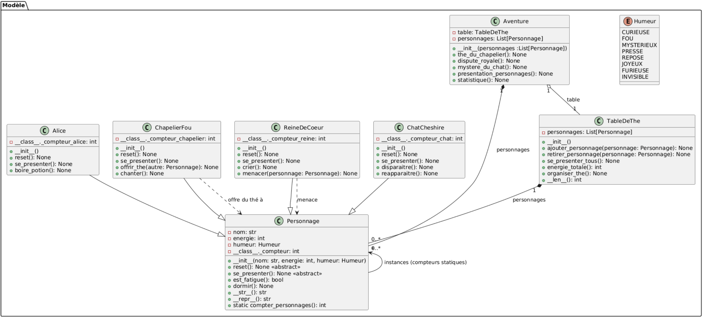

# Informations générales

**Date de remise** : 23 novembre à 23:59

**À remettre sur** : GitHub (nous allons corriger votre dernier git push effectué avant la date limite)

# Objectif
Ce TP a pour objectif de vous introduire à la programmation orientée objet (POO) en Python à travers l'univers fantastique d'**Alice au pays des merveilles**. Durant ce TP, vous allez vous familiariser avec les concepts suivantes:  
- Créer et utiliser des classes et des objets.
- Définir des constructeurs et initialiser des attributs.
- Mettre en œuvre l’héritage pour spécialiser des classes.
- Comprendre et appliquer le polymorphisme.
- Découvrir les méthodes spéciales de Python.

# Consignes à respecter
Tout d'abord, assurez-vous d'avoir lu le fichier [readme.md](readme.md) au complet et d'avoir téléchargé les fichiers que vous devrez compléter.

Pour ce TP, certaines contraintes sont à respecter:
- Les classes devront être conçues de manière à respecter les principes de la POO.
- Vous ne pouvez pas modifier le fichier constantes.py, sinon le projet final risque de ne pas fonctionner.
- Les imports sont déjà faits, donc pas besoin d'importer rien de nouveau.
- **Noms de variables et fonctions adéquats (concis, compréhensibles).**

# Mise en contexte

Le pays des merveilles est peuplé de personnages étranges et merveilleux. Dans ce TP, vous allez créer une classe de base `Personnage` qui définit les attributs communs à tous (nom, énergie, humeur). Vous spécialiserez cette classe en créant des personnages comme `Alice`, `ChapelierFou`, `ReineDeCoeur`, `ChatCheshire`. Chaque personnage aura des méthodes spécifiques (parler, se déplacer, lancer une action magique, etc.). Enfin, vous allez organiser une **simulation de rencontre** dans laquelle ces personnages interagissent.

Voici un petit diagramme de classes qui décrit comment le projet est structuré

 **Diagramme de classes**


# Faire fonctionner le TP
Dans ce fichier, vous allez **mettre en pratique l’ensemble des notions abordées dans le TP** : héritage, polymorphisme, composition et éléments statiques.

Le fichier `main.py` servira à **tester et faire interagir vos classes** à travers plusieurs étapes correspondant aux sections `PARTIE 2` à `PARTIE 5`.

Il est donc important de **compléter progressivement ce fichier** au fur et à mesure que vous terminez chaque partie du TP, afin de vérifier le bon fonctionnement de vos classes et de leur interaction dans l’aventure d’Alice au pays des merveilles.

# Partie 1 - Création des classes de base
Pour commencer, il faut coder la classe de base `Personnage` dans le fichier personnage.py. 

### Personnage
Le constructeur de la classe Personnage doit être utilisé comme suit:

```Python
nom = "Alice"
energie = 100
humeur = "curieuse"
personnage1 = Personnage(nom, energie, humeur)
```

La classe Personnage doit implémenter les méthodes suivantes:
 **Méthodes**

| **Méthode**          | Description                                                                                                                                       | Exemple d'affichage                                   |
| -------------------- | ------------------------------------------------------------------------------------------------------------------------------------------------- | ----------------------------------------------------- |
| **`__init__()`**     | Méthode constructeur                                                                                                                              | N/A                                                   |
| **`reset()`**        | Méthode abstraite doit être redéfinie dans chaque sous-classe qui permet de réinitialiser les attributs du personnage à leurs valeurs par défaut. | N/A                                                   |
| **`se_presenter()`** | Méthode abstraite doit être redéfinie dans chaque sous-classe qui d'afficher une phrase de présentation du personnage.                            | N/A                                                   |
| **`est_fatigue()`**  | Méthode d'instance qui retourne True si l’énergie du personnage est inférieure à 20, sinon False.                                                 | N/A                                                   |
| **`dormir()`**       | Méthode d'instance qui reme l’énergie du personnage à 100, change son humeur à Humeur.REPOSE.                                                     | `Alice a bien dormi. Énergie = 100, humeur = repose.` |

# Partie 2 - Héritage et polymorphisme

On veut créer les classes dérivées de `Personnage`, soit la classe `Alice` dans le fichier [alice.py](./alice.py), la classe `ChapelierFou` dans le fichier [chapelier_fou.py](./chapelier_fou.py), la classe `ReineDeCoeur` dans le fichier [reine_de_coeur.py](./reine_de_coeur.py) et la classe `ChatCheshire` dans le fichier [chat_cheshire.py](./chat_cheshire.py).
### Alice
La classe Alice dérive de la classe Personnage. Elle hérite de **Personnage** et implémente toutes ses méthodes abstraites, en plus d’ajouter un comportement propre au personnage. Le constructeur de la classe **Alice** doit être utilisé comme suit :

```python
alice1 = Alice()
```

| **Méthode**          | **Description**                                                                                                                                                | Exemple d’affichage                                            |
| -------------------- | -------------------------------------------------------------------------------------------------------------------------------------------------------------- | ------------------------------------------------------------------ |
| **`__init__()`**     | Constructeur qui initialise un personnage Alice avec les valeurs par défaut : <br>– `nom = "Alice"` <br>– `energie = 100` <br>– `humeur = Humeur.CURIEUSE`<br> | N/A                                                                |
| **`reset()`**        | Réinitialise les attributs `energie` et `humeur` aux valeurs par défaut.                                                                                       | N/A                                                                |
| **`se_presenter()`** | Affiche une phrase de présentation propre à Alice.                                                                                                             | `Je suis Alice, pleine de curiosité.`                              |
| **`boire_potion()`** | Augmente l’énergie de 10 (sans dépasser 100), change l’humeur à `"grandie"` et affiche un message décrivant l’action.                                          | `Alice boit une potion magique ! Énergie = 110, humeur = grandie.` |
### ChapelierFou

La classe **ChapelierFou** dérive de la classe **Personnage**. Elle hérite de **Personnage** et implémente toutes ses méthodes abstraites, en plus d’ajouter un comportement propre au personnage.  Le constructeur de la classe **ChapelierFou** doit être utilisé comme suit :

```python
chapelier1 = ChapelierFou()
```

| **Méthode**                        | **Description**                                                                                                                                      | **Exemple d’affichage**                                                                                              |
| ---------------------------------- | ---------------------------------------------------------------------------------------------------------------------------------------------------- | -------------------------------------------------------------------------------------------------------------------- |
| **`__init__()`**                   | Constructeur qui appelle celui de la classe parente `Personnage` avec : <br>– `nom = "Chapelier Fou"`<br>– `energie = 90`<br>– `humeur = Humeur.FOU` | N/A                                                                                                                  |
| **`reset()`**                      | Réinitialise les attributs `energie` et `humeur` à leurs valeurs par défaut.                                                                         | N/A                                                                                                                  |
| **`se_presenter()`**               | Affiche une phrase thématique propre au Chapelier Fou.                                                                                               | `Je suis Chapelier Fou, un peu fou.`                                                                                 |
| **`offrir_the(autre_personnage)`** | Le Chapelier Fou offre du thé magique à un autre personnage.                                                                                         | `Chapelier Fou offre du thé magique à Alice ! Alice gagne 15 énergie. Énergie = 95. Humeur du Chapelier = généreux.` |
| **`chanter()`**                    | Le Chapelier Fou chante une chanson absurde.                                                                                                         | `Le Chapelier Fou chante une chanson absurde ! Humeur = joyeux.`                                                     |

### ChatCheshire

La classe **ChatCheshire** dérive de la classe **Personnage**. Elle hérite de **Personnage** et implémente toutes ses méthodes abstraites, en plus d’ajouter un comportement propre au personnage. Le constructeur de la classe **ChatCheshire** doit être utilisé comme suit :

```python
chat1 = ChatCheshire()
```

| **Méthode**          | **Description**                                                                                                                                                             | **Exemple d’affichage**                                                       |
| -------------------- | --------------------------------------------------------------------------------------------------------------------------------------------------------------------------- | ----------------------------------------------------------------------------- |
| **`__init__()`**     | Constructeur qui appelle celui de la classe parente `Personnage` avec les valeurs : <br>– `nom = "Chat Cheshire"`<br>– `energie = 70`<br>– `humeur = Humeur.MYSTERIEUX`<br> | N/A                                                                           |
| **`reset()`**        | Réinitialise les attributs `energie` et `humeur` à leurs valeurs par défaut.                                                                                                | N/A                                                                           |
| **`se_presenter()`** | Affiche une phrase thématique propre au Chat Cheshire.                                                                                                                      | `Je suis Chat Cheshire, avec un sourire énigmatique.`                         |
| **`disparaitre()`**  | Le Chat Cheshire disparaît dans un sourire.                                                                                                                                 | `Chat Cheshire disparaît dans un sourire... Humeur = invisible, Énergie = 0.` |
| **`reapparaitre()`** | Le Chat Cheshire réapparaît soudainement.                                                                                                                                   | `Chat Cheshire réapparaît soudainement ! Humeur = mystérieux, Énergie = 0.`   |

### ReineDeCoeur

La classe **ReineDeCoeur** dérive de la classe **Personnage**. Elle hérite de **Personnage** et implémente toutes ses méthodes abstraites, en plus d’ajouter un comportement propre au personnage.  Le constructeur de la classe **ReineDeCoeur** doit être utilisé comme suit :
#### **Méthodes**

| **Méthode**               | **Description**                                                                                                                                          | **Exemple d’affichage**                                                |
| ------------------------- | -------------------------------------------------------------------------------------------------------------------------------------------------------- | ---------------------------------------------------------------------- |
| **`__init__()`**          | Constructeur qui appelle le constructeur parent `Personnage` avec : <br>– `nom = "Reine de Coeur"`<br>– `energie = 80`<br>– `humeur = Humeur.PRESSE`<br> | N/A                                                                    |
| **`reset()`**             | Réinitialise les attributs `energie` et `humeur` à leurs valeurs par défaut.                                                                             | N/A                                                                    |
| **`se_presenter()`**      | Affiche une phrase thématique propre à la Reine de Coeur.                                                                                                | `Je suis Reine de Coeur, toujours furieuse.`                           |
| **`crier()`**             | La Reine crie sa célèbre réplique et devient furieuse. <br>                                                                                              | `Reine de Coeur crie : 'Qu'on lui coupe la tête !' Humeur = furieuse.` |
| **`menacer(personnage)`** | La Reine menace un autre personnage.                                                                                                                     | `Reine de Coeur menace Alice ! Alice est maintenant terrifiée.`        |

# Partie 3 - Composition
La composition est un principe de conception qui consiste à combiner des objets ou des fonctions plus simples pour construire des structures ou comportements plus complexes, sans recourir à l’héritage.  La classe `TableDeThe` va être composée d’objets `Personnage` contenue dans une liste.
### TableDeThe

La classe **TableDeThe** gère la liste des personnages participant à un thé. Elle permet d’ajouter, de retirer et de faire interagir les personnages, notamment lors d’un thé organisé par le **TableDeThe.** Le constructeur de la classe TableDeThe doit être utilisé comme suit:

```Python
table = TableDeThe()
```
#### **Méthodes**

| **Méthode**                          | **Description**                                                                        | **Exemple d’affichage**                                                                  |
| ------------------------------------ | -------------------------------------------------------------------------------------- | ---------------------------------------------------------------------------------------- |
| **`__init__()`**                     | Constructeur qui initialise l’attribut d’instance `personnages` à une liste vide.      | N/A                                                                                      |
| **`ajouter_personnage(personnage)`** | Ajoute un personnage à la table s’il n’y est pas déjà.                                 | `Alice rejoint la table du thé.` <br>`Alice est déjà à la table.`                        |
| **`retirer_personnage(personnage)`** | Retire un personnage de la table.                                                      | `Chat du Cheshire quitte la table du thé.` <br>`Reine de Coeur n'était pas à la table.`  |
| **`se_presenter_tous()`**            | Fait se présenter tous les personnages à la table.                                     | `Autour de la table, chacun se présente :`<br>`Je suis Alice, pleine de curiosité.` |
| **`energie_totale()`**               | Calcule et retourne la somme des énergies de tous les personnages présents à la table. | N/A                                                                                      |
| **`organiser_the()`**                | Organise un thé magique dirigé par le **Chapelier Fou**.                               | `Chapelier Fou organise un thé magique !`                                                |


> [!Indice]
> `isinstance(p, ChapelierFou)` vérifie si `p` est **une instance de la classe** `ChapelierFou` (ou d’une de ses sous-classes).  

# Partie 4 - Élément statique et built-in
### Attributs de statique
Les **attributs statiques**, aussi appelés attributs de classe, sont des variables partagées par toutes les instances d'une même classe et existent indépendamment de ces instances. Elle peut être appelée directement sur le nom de la classe (par exemple, `Classe.attribut_statique`).

| **Classe**         | **Nom**                   | **Description**                                                                                                                                |
| ------------------ | ------------------------- | ---------------------------------------------------------------------------------------------------------------------------------------------- |
| **`Personnage`**   | **`_compteur`**           | Compte le nombre total d’instances de la classe Personnage créées.                                                                             |
| **`Alice`**        | **`_compteur_alice`**     | Compte le nombre total d’instances de la classe Alice créées. Sert à numéroter les instances si plusieurs Alice existent.                      |
| **`ChapelierFou`** | **`_compteur_chapelier`** | Compte le nombre total d’instances de la classe `ChapelierFou` créées. Sert à numéroter les instances lorsque plusieurs ChapelierFou existent. |
| **`ChatCheshire`** | **`_compteur_chat`**      | Compte le nombre total d’instances de la classe `ChatCheshire` créées. Sert à numéroter les instances lorsque plusieurs chats existent.        |
| **`ReineDeCoeur`** | **`_compteur_reine`**     | Compte le nombre total d’instances de la classe `ReineDeCoeur` créées. Sert à numéroter les reines lorsqu’il y en a plusieurs.                 |
### Méthode statique
Une **méthode statique** est une fonction définie au sein d'une classe qui appartient à la classe elle-même et non à une instance spécifique de cette classe. Elle peut être appelée directement sur le nom de la classe (par exemple, `Classe.methodeStatique()`) sans qu'il soit nécessaire de créer un objet de cette classe.

| **Classe**       | **Nom**                   | **Description**                                                      |
| ---------------- | ------------------------- | -------------------------------------------------------------------- |
| **`Personnage`** | **`compter_personnages`** | Retourne le nombre total d’instances de la classe Personnage créées. |
### Redéfinition des fonctions built-in
| **Classe**           | **Nom**        | **Description**                                                                                                                                 |
| -------------------- | -------------- | ----------------------------------------------------------------------------------------------------------------------------------------------- |
| **`Personnage`**     | **`__str__`**  | Afficher le nom et l'humeur du personnage<br><br>Exemple d'affichage : <br>`Je m'appelle Alice, j'ai 100 points d'énergie et je suis curieuse.` |
| **`Personnage`**<br> | **`__repr__`** | Obtenir une représentation technique<br><br>Exemple d'affichage :<br>`Personnage(nom='Alice', energie=100, humeur='curieuse')`                  |
| **`TableDeThe`**     | **`__len__`**  | Retourne le nombre de personnages présents à la table de thé.                                                                                   |
|                      |                |                                                                                                                                                 |

# Partie 5 - Simulation de l’aventure (bonus)

La classe **Aventure** orchestre différents événements impliquant les personnages du _Pays des Merveilles_.   Elle s’appuie sur la classe **TableDeThe** pour gérer les interactions collectives, et sur les classes dérivées de **Personnage** pour simuler les comportements.

> `next((p for p in self.personnages if ...), None)` parcourt les personnages et **renvoie le premier** qui satisfait la condition. Si aucun n’est trouvé, la valeur `None` est renvoyée. 


### Critères d'évaluation
- Fonctionnalité (90%)
- Qualité du code (10%)
